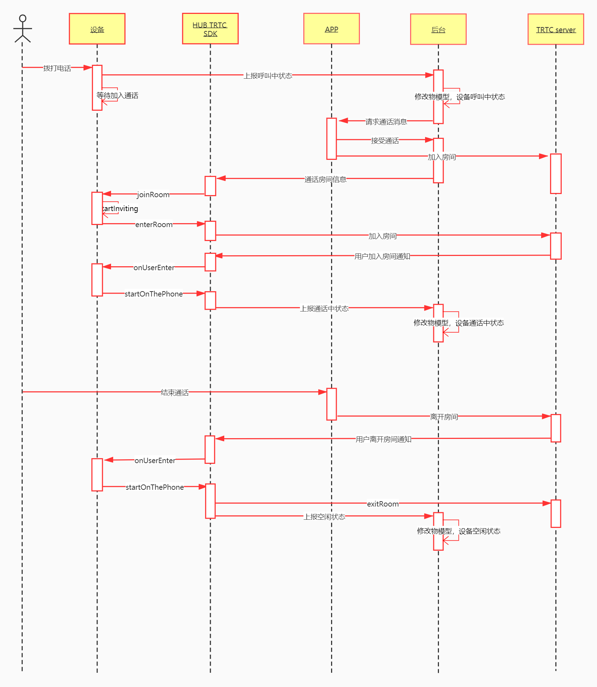

简体中文 | [English](docs/en/README.md)

* [IoT Explorer RTC Android SDK开发指南](#IoT-Explorer-RTC-Android-SDK开发指南)
  * [引用方式](#引用方式)
  * [API说明](#API说明)
     *  [explorer-device-android SDK 设计说明](#explorer-device-android-SDK-设计说明)
     *  [explorer-device-rtc SDK 设计说明](#explorer-device-rtc-SDK-设计说明)
     *  [explorer-device-rtc SDK 回调callback 设计说明](#explorer-device-rtc-SDK-回调callback-设计说明)
     *  [explorer-device-rtc SDK 自定义音频数据](#explorer-device-rtc-SDK-自定义音频数据)
  * [通话流程梳理](#通话流程梳理)

# IoT Explorer RTC Android SDK开发指南

本文主要描述腾讯云物联网开发平台设备端IoT Explorer Android-SDK中接入腾讯云实时音视频 TRTC Android-SDK 开发指南 。

## 引用方式

- 集成 SDK 方式

如果不需要接入实时音视频 TRTC SDK，仅需要接入explorer-device-android SDK，请参考 [编译环境及SDK接入说明.md](../explorer-device-android/docs/zh/编译环境及SDK接入说明.md)

 -  gradle 工程 正式版SDK 远程构建

    在应用模块的build.gradle中配置，具体版本号可参考 [Latest release](https://github.com/tencentyun/iot-device-java/releases) 版本 
    ``` gr
    dependencies {
        implementation 'com.tencent.iot.explorer:explorer-device-rtc:x.x.x' //IoT Explorer 与 实时音视频 TRTC 的依赖
    }
    ```
 -  gradle 工程 snapshot版SDK 远程构建

    > 建议使用正式版SDK，SNAPSHOT版本会静默更新，使用存在风险

    在工程的build.gradle中配置仓库url
    ``` gr
    allprojects {
        repositories {
            google()
            jcenter()
            maven {
                url "https://oss.sonatype.org/content/repositories/snapshots"
            }
        }
    }
    ```
    在应用模块的build.gradle中配置，具体版本号可参考 [Latest release](https://github.com/tencentyun/iot-device-java/releases) 版本，末位+1
    ``` gr
    dependencies {
        implementation 'com.tencent.iot.explorer:explorer-device-rtc:x.x.x-SNAPSHOT' //IoT Explorer 与 实时音视频 TRTC 的依赖
    }
    ```
 -  依赖本地sdk源码 构建
    修改应用模块的 **[build.gradle](../device-android-demo/build.gradle)**，使应用模块依赖 [explorer-device-rtc](../explorer-device-rtc)源码，示例如下：
    
     ```gr
    dependencies {
        implementation project(':explorer:explorer-device-rtc') //IoT Explorer 与 实时音视频 TRTC 的依赖，注意添加相互依赖的其他sdk module
    }
     ```

Demo示例工程使用的是 依赖本地 explorer-device-android 和 explorer-device-rtc 的 sdk源码 构建方式。

## API说明

### explorer-device-android SDK 设计说明

explorer-device-android 请参考 [SDK API及参数说明.md](../explorer-device-android/docs/SDK%20API及参数说明.md)

### explorer-device-rtc SDK 设计说明

| 类名                     | 功能                                         |
| ----------------------- | -------------------------------------------- |
| TXTRTCDataTemplate      | 实现实时音视频数据模板基本功能                   |
| TXTRTCTemplateClient    | 实现直连设备根据实时音视频数据模板连接物联网开发平台|

#### TXTRTCDataTemplate

TXTRTCDataTemplate 继承自 TXDataTemplate类

```
    /**
     * 上报实时音视频类设备呼叫属性
     * @param callStatus 呼叫状态 0 - 空闲或拒绝呼叫  1 - 进行呼叫  2 - 通话中
     * @param callType 邀请类型 1-语音通话，2-视频通话
     * @param userId 被呼叫用户id 多个用户id用";"分割，      也可以为空字符串""，表示群呼，      也可以为字符串"null"，传入params，请做数据转发到您的后台服务，请参考: https://cloud.tencent.com/document/product/1081/40298
     * @param agent 代理方  标识哪一方发起的呼叫，可以传空字符串，则不会上报agent。
     * @param params 用户的物模型属性json
     * @return 发送请求成功时返回Status.OK;。 OK 成功， ERROR 发生错误， ERR_JSON_CONSTRUCT json构造失败， PARAMETER_INVALID Topic无效， MQTT_NO_CONN MQTT未连接
     */
    public Status reportCallStatusProperty(Integer callStatus, Integer callType, String userId, String agent, JSONObject params)
```


#### TXTRTCTemplateClient

TXTRTCTemplateClient 继承自 TXMqttConnection 类

```
    /**
     * 是否已经连接物联网开发平台
     * @return 是 、 否
     */
    public boolean isConnected()

    /**
     * 订阅数据模板相关主题
     * @param topicId 主题ID
     * @param qos QOS等级
     * @return 发送请求成功时返回Status.OK;
     */
    public Status subscribeTemplateTopic(TXDataTemplateConstants.TemplateSubTopic topicId, final int qos)

    /**
     * 取消订阅数据模板相关主题
     * @param topicId 主题ID
     * @return 发送请求成功时返回Status.OK;
     */
    public Status unSubscribeTemplateTopic(TXDataTemplateConstants.TemplateSubTopic topicId)

    /**
     * 属性上报
     * @param property 属性的json
     * @param metadata 属性的metadata，目前只包含各个属性对应的时间戳
     * @return 发送请求成功时返回Status.OK;
     */
    public Status propertyReport(JSONObject property, JSONObject metadata)

    /**
     * 上报实时音视频类设备呼叫属性
     * @param callStatus 呼叫状态 0 - 空闲或拒绝呼叫  1 - 进行呼叫  2 - 通话中
     * @param callType 邀请类型 1-语音通话，2-视频通话
     * @param userId 被呼叫用户id 多个用户id用";"分割，      也可以为空字符串""，表示群呼，      也可以为字符串"null"，传入params，请做数据转发到您的后台服务，请参考: https://cloud.tencent.com/document/product/1081/40298
     * @param agent 代理方  标识哪一方发起的呼叫，可以传空字符串，则不会上报agent。
     * @param params 用户的物模型属性json
     * @return 发送请求成功时返回Status.OK;
     */
    public Status reportCallStatusProperty(Integer callStatus, Integer callType, String userId, String agent, JSONObject params)

    /**
     * 获取状态
     * @param type 类型
     * @param showmeta 是否携带showmeta
     * @return 发送请求成功时返回Status.OK;
     */
    public Status propertyGetStatus(String type, boolean showmeta)

    /**
     * 设备基本信息上报
     * @param params 参数
     * @return 发送请求成功时返回Status.OK;
     */
    public Status propertyReportInfo(JSONObject params)

    /**
     * 清理控制信息
     * @return 发送请求成功时返回Status.OK;
     */
    public Status propertyClearControl()

    /**
     * 单个事件上报
     * @param eventId 事件ID
     * @param type 事件类型
     * @param params 参数
     * @return 发送请求成功时返回Status.OK;
     */
    public Status eventSinglePost(String eventId, String type, JSONObject params)

    /**
     * 多个事件上报
     * @param events 事件集合
     * @return 发送请求成功时返回Status.OK;
     */
    public Status eventsPost(JSONArray events)
```

### explorer-device-rtc SDK 回调callback 设计说明

TXTRTCCallBack 授权回调callback说明如下：

```
    /**
     * 获取RTC属性呼叫状态
     *
     * @param callStatus            呼叫状态 0 - 空闲或拒绝呼叫  1 - 进行呼叫  2 - 通话中
     * @param userid                用户id
     * @param agent                 代理方  标识哪一方发起的呼叫。
     * @param callType              邀请类型 1-语音通话，2-视频通话
     */
    public abstract void onGetCallStatusCallBack(Integer callStatus, String userid, String agent, Integer callType);

    /**
     * 获取rtc进入房间所需参数模型
     *
     * @param room
     */
    public abstract void trtcJoinRoomCallBack(RoomKey room);
```

### explorer-device-rtc SDK 自定义音频数据
#### SDK接入方自行采集音频
##### 1. 启用音频自定义采集模式
> 调用TRTCCloud的`enableCustomAudioCapture(boolean enable)`方法即可开启音频自定义采集模式

> 开启该模式后，SDK不再运行原有的音频采集流程，即不再继续从麦克风采集音频数据，而是只保留音频编码和发送能力。您需要通过`sendCustomAudioData`不断地向 SDK 发送自己采集的音频数据。

##### 2. 发送自定义音频数据
调用TRTCCloud的`sendCustomAudioData(TRTCCloudDef.TRTCAudioFrame frame)`

参数`TRTCAudioFrame`推荐下列填写方式（其他字段不需要填写）：
* audioFormat：音频数据格式，仅支持 TRTCAudioFrameFormatPCM。
* data：音频帧 buffer。音频帧数据只支持 PCM 格式，支持[5ms ~ 100ms]帧长，推荐使用 20ms 帧长，长度计算方法：【48000采样率、单声道的帧长度：48000 × 0.02s × 1 × 16bit = 15360bit = 1920字节】。
* sampleRate：采样率，支持：16000、24000、32000、44100、48000。
* channel：声道数（如果是立体声，数据是交叉的），单声道：1； 双声道：2。
* timestamp：时间戳，单位为毫秒（ms），请使用音频帧在采集时被记录下来的时间戳（可以在采集到一帧音频帧之后，通过调用TRTCCloud的`generateCustomPTS`方法获取时间戳）。

***

其中`generateCustomPTS()`生成自定义采集时的时间戳，该方法返回 时间戳（单位：ms）
> 本接口仅适用于自定义采集模式，用于解决音视频帧的采集时间（capture time）和投送时间（send time）不一致所导致的音画不同步问题。 当您通过`sendCustomAudioData`接口进行自定义视频或音频采集时，请按照如下操作使用该接口：

> 首先，在采集到一帧视频或音频帧时，通过调用本接口获得当时的 PTS 时间戳。之后可以将该视频或音频帧送入您使用的前处理模块（如第三方美颜组件，或第三方音效组件）。在真正调用sendCustomAudioData进行投送时，请将该帧在采集时记录的`PTS`时间戳赋值给 TRTCAudioFrame 中的 timestamp 字段。

##### 3. 代码示例
```
//启用音频自定义采集模式
mTRTCCloud.enableCustomAudioCapture(true);
...
//发送自定义音频数据
TRTCCloudDef.TRTCAudioFrame trtcAudioFrame = new TRTCCloudDef.TRTCAudioFrame();
trtcAudioFrame.data = data;
trtcAudioFrame.sampleRate = sampleRate;
trtcAudioFrame.channel = channel;
trtcAudioFrame.timestamp = timestamp;
mTRTCCloud.sendCustomAudioData(trtcAudioFrame);
```

#### SDK接入方使用SDK内部采集的音频

本地麦克风采集到的原始音频数据回调

`void onCapturedRawAudioFrame(TRTCCloudDef.TRTCAudioFrame frame)`

当您设置完音频数据自定义回调之后，SDK 内部会把刚从麦克风采集到的原始音频数据，以 PCM 格式的形式通过本接口回调给您。

* 此接口回调出的音频时间帧长固定为0.02s，格式为 PCM 格式。
* 由时间帧长转化为字节帧长的公式为【采样率 × 时间帧长 × 声道数 × 采样点位宽】。
* 以 TRTC 默认的音频录制格式48000采样率、单声道、16采样点位宽为例，字节帧长为【48000 × 0.02s × 1 × 16bit = 15360bit = 1920字节】。

参数
> frame	PCM 格式的音频数据帧
注意
* 请不要在此回调函数中做任何耗时操作，由于 SDK 每隔 20ms 就要处理一帧音频数据，如果您的处理时间超过 20ms，就会导致声音异常。
* 此接口回调出的音频数据是可读写的，也就是说您可以在回调函数中同步修改音频数据，但请保证处理耗时。
* 此接口回调出的音频数据**不包含**背景音、音效、混响等前处理效果，延迟极低。

参考文档：[自定义采集](https://cloud.tencent.com/document/product/647/34066) [接口API](https://cloud.tencent.com/document/product/647/32267#.E8.87.AA.E5.AE.9A.E4.B9.89.E9.87.87.E9.9B.86.E5.92.8C.E8.87.AA.E5.AE.9A.E4.B9.89.E6.B8.B2.E6.9F.93) [音频数据自定义回调](https://cloud.tencent.com/document/product/647/32267#.E9.9F.B3.E9.A2.91.E6.95.B0.E6.8D.AE.E8.87.AA.E5.AE.9A.E4.B9.89.E5.9B.9E.E8.B0.83) [官方Demo](https://cloud.tencent.com/document/product/647/32689)

## 设备与用户绑定说明

Android设备通常具备丰富的人机交互界面（屏幕/键盘），用户可以直接输入 SSID/PSW 进行连接入网。

可使用`连连APP/小程序`扫描由以下接口生成的二维码，建立用户与设备之间的绑定关系。

```
explorer-device-android TXMqttConnection 类 的接口
    /**
     * 生成绑定设备的二维码字符串
     * @return 生成的绑定设备的二维码字符串;
     */
    public String generateDeviceQRCodeContent()

    /**
     * 生成支持微信扫一扫跳转连连小程序的绑定设备的二维码字符串
     * @return 生成的绑定设备的二维码字符串;
     */
    public String generateDeviceWechatScanQRCodeContent()
```

## 通话流程梳理

### 连连APP/小程序 视频呼叫 Android设备端

时序图：


1. 连连APP/小程序 在控制面板页面中点击 视频呼叫。

2. 云服务通过mqtt转发 连连APP/小程序 的呼叫请求，触发设备端 TXTRTCCallBack 中 onGetCallStatusCallBack 回调，其中：
> * 回调参数 callStatus 为1（进行呼叫）
> * userid 为 连连APP/小程序 的发起呼叫的用户id
> * agent为代理方，标识哪一方发起的呼叫。
> * callType为步骤1中传递的对应呼叫的类型

接到此消息后需要调用
```
TRTCUIManager.getInstance().setSessionManager(new TRTCExplorerDemoSessionManager(mDataTemplateSample)); //方便在页面中上报设备的状态
TRTCVideoCallActivity.startBeingCall(TRTCMainActivity.this, new RoomKey(), userid, agent);//跳转到对应的视频被呼叫页面
```

3、当设备端点击了接听按钮时，需要调用
``` 
TRTCUIManager.getInstance().didAcceptJoinRoom(TRTCCalling.TYPE_VIDEO_CALL, mSponsorUserInfo.getUserId(), mSponsorUserInfo.getAgent());
```
告知 连连APP/小程序 的用户设备同意此次呼叫请求。

4、云服务通过websocket转发 设备端同意当前 连连APP/小程序 用户的呼叫请求，连连APP/小程序 继续请求进入房间参数，并进入对应的视频房间。

5、云服务通过mqtt转发 连连APP/小程序 进入房间行为，触发设备端 TXTRTCCallBack 中 trtcJoinRoomCallBack 回调，其中
> * 回调参数 room 为对应的房间参数

接到此消息后需要调用
``` 
TRTCUIManager.getInstance().joinRoom(mCallType, "", room); //加入房间，更新视频呼叫属性为通话中。
```

6、连连APP/小程序 和 设备端 进行视频通话。

7、当主动挂断，或收到对方挂断的回调 ``` public void onUserLeave(final String userId) ``` 后，退出当前音视频页面并调用 
``` 
TRTCUIManager.getInstance().didExitRoom(TRTCCalling.TYPE_VIDEO_CALL, mSponsorUserInfo.getUserId()); //更新视频呼叫属性为空闲。
```

**连连APP/小程序 音频呼叫 Android设备端 流程和视频呼叫类似，注意修改对应的呼叫类型**

### Android设备端 视频呼叫 连连APP/小程序

时序图：



1、设备端点击视频呼叫，需要调用
```
mDataTemplateSample.reportCallStatusProperty(TRTCCallStatus.TYPE_CALLING, TRTCCalling.TYPE_VIDEO_CALL, userId, agent, null); //更新视频呼叫属性为进行呼叫。
TRTCUIManager.getInstance().setSessionManager(new TRTCExplorerDemoSessionManager(mDataTemplateSample)); //方便在页面中上报设备的状态
TRTCVideoCallActivity.startCallSomeone(TRTCMainActivity.this, agent, userId);//跳转到对应的视频呼叫页面  
```

2、云服务通过mqtt转发 设备端 的呼叫请求，连连APP/小程序 跳转到被呼叫页面，当用户点击了同意当前 设备端 呼叫请求时，连连APP/小程序 继续请求进入房间参数，并进入对应的视频房间。

3、云服务通过mqtt转发 连连APP/小程序 进入房间行为，触发设备端 TXTRTCCallBack 中 trtcJoinRoomCallBack 回调，其中
> * 回调参数 room 为对应的房间参数

接到此消息后需要调用
``` 
TRTCUIManager.getInstance().joinRoom(mCallType, "", room); //加入房间，更新视频呼叫属性为通话中。
```

4、连连APP/小程序 和 设备端 进行视频通话。

5、当主动挂断，或收到对方挂断的回调 ``` public void onUserLeave(final String userId) ``` 后，退出当前音视频页面并调用 
``` 
TRTCUIManager.getInstance().didExitRoom(TRTCCalling.TYPE_VIDEO_CALL, mSponsorUserInfo.getUserId()); //更新视频呼叫属性为空闲。
```

**Android设备端 音频呼叫 连连APP/小程序 流程和视频呼叫类似，注意修改对应的呼叫类型**